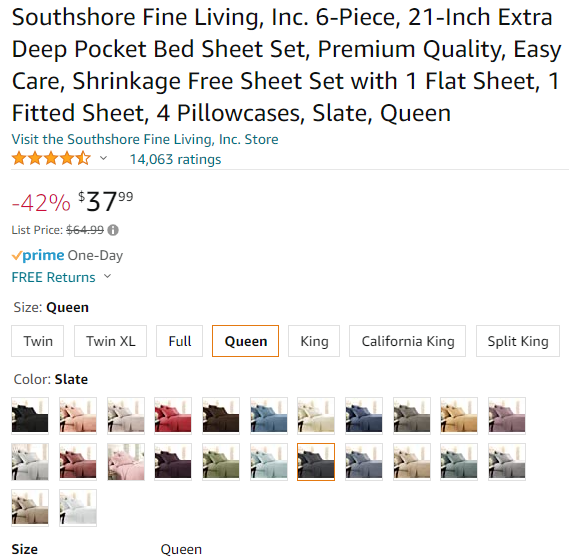
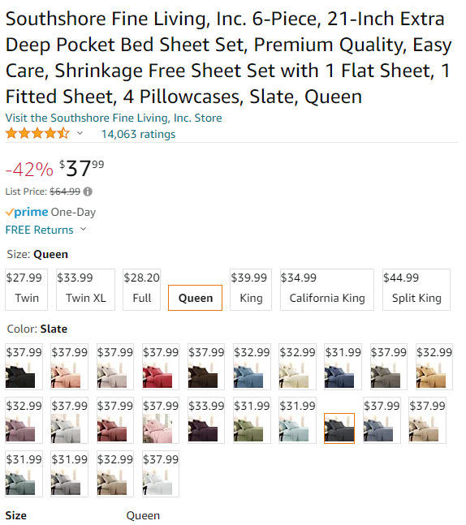

# Amazon Scripts

## Amazon.com

### [Amazon Variation Pricer](AmazonVariationPricer.user.js)
Shows prices on every color/size option of item.

|Turns this | Into this |
|---|---|
|||

Notes:
* This was a quick hack to solve the few cases I've needed- it this doesn't work on every kind of page on Amazon. Some pages actually implement this where I avoid breaking things. Please open an issue and paste the link of pages which don't work well.
* TODO: full international support. Open an issue to ping me or create a pull request with the missing @match annotation.
* TBD: should I sort by price? Let me know if that sounds useful. It makes international support a bit trickier.

### [Amazon Subscription Total](AmazonSubscriptionTotal.user.js)

Shows an estimated cost of your upcoming Subscribe & Save items based on the current prices displayed.

## Prime Gaming

### [Prime Gaming - Shade Redeemed](PrimeGaming-ShadeRedeemed.user.js)

Makes it easier to see which items have not yet been redeemed.

