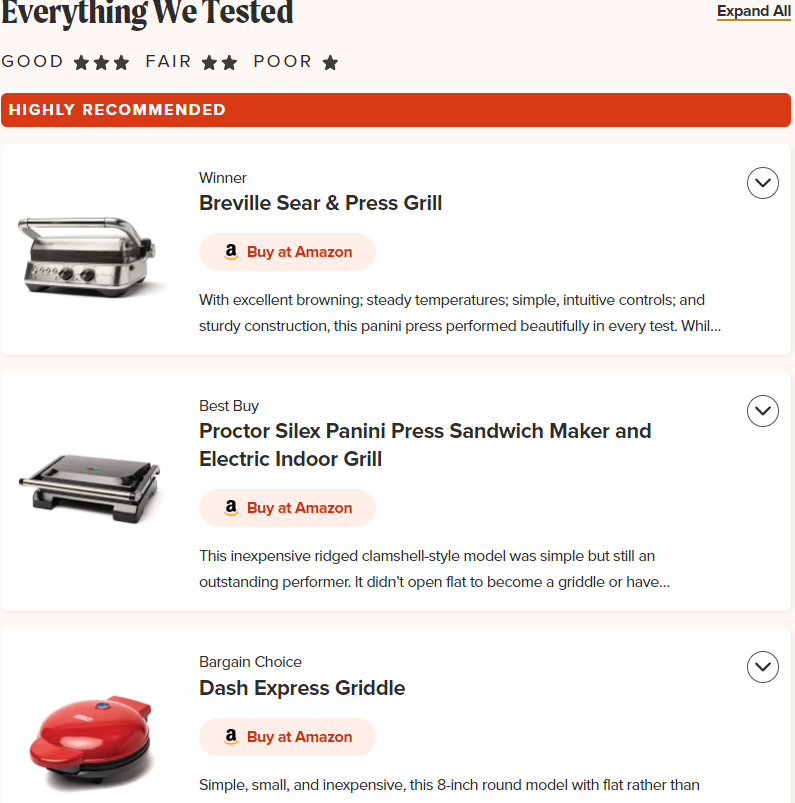
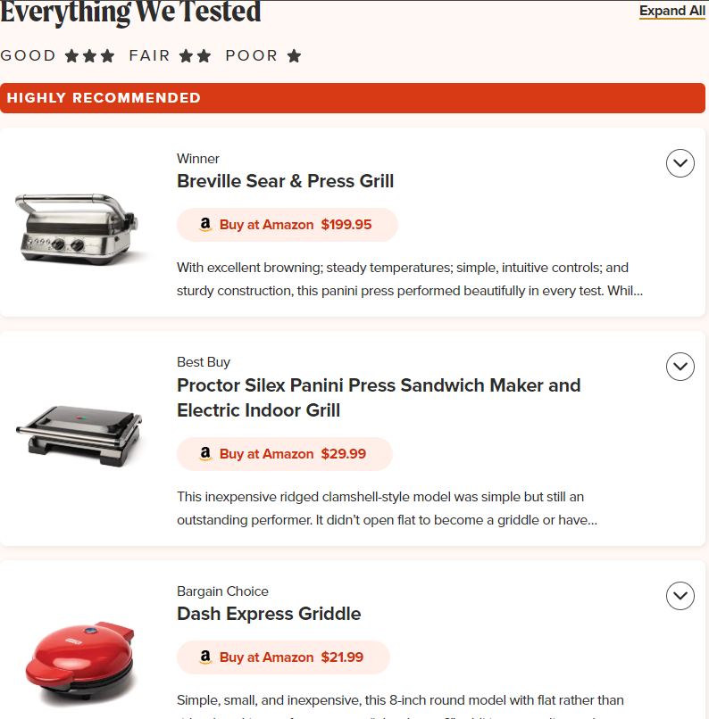

# America's Test Kitchen

### [Show Amazon Pricing](AmazonPricing.user.js)
Shows the Amazon price for every linked product.

|Turns this | Into this |
|---|---|
|||

Note: This was a quick hack to solve the few cases I've needed- it this doesn't work on every kind of page on Amazon. Some pages actually implement this where I avoid breaking things. Please open an issue and paste the link of pages which don't work well.

* Possible future development (open an issue if you want something):
  * Support for products which list multiple retailers. Some product cards point to both Amazon and Walmart or other retailers (e.g. the [lames review](https://www.americastestkitchen.com/equipment_reviews/2545-the-best-bread-lames) points to Wire Monkey).