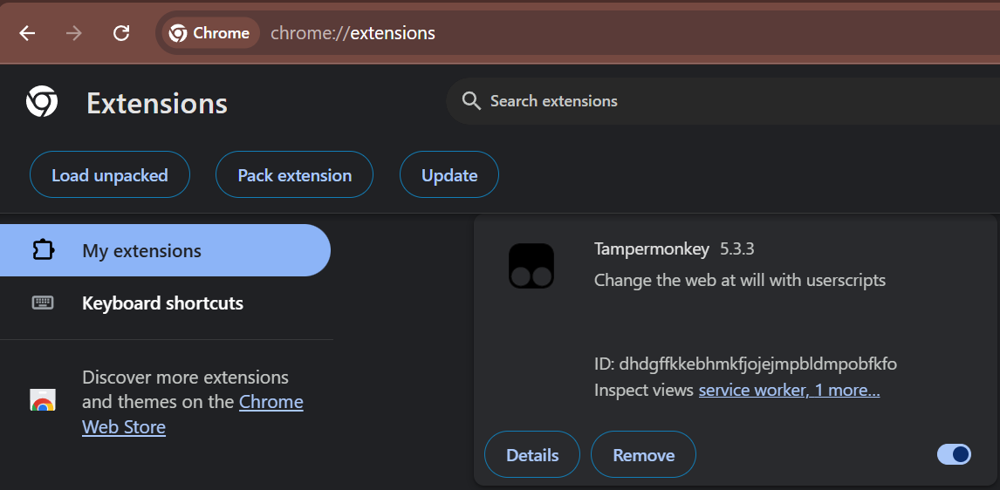
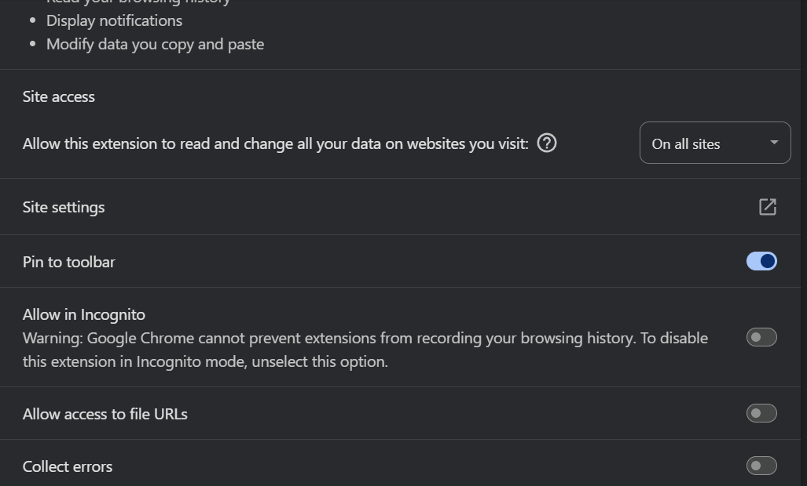
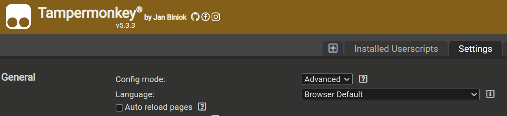
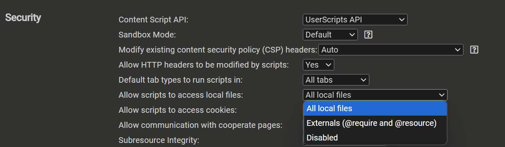

# Development Process

My typical process to develop scripts is using an IDE like VS Code on files located on my git repository on disk (aka "local files").

This provides all the benefits of using a sophisticated editor, while being able to quickly test the code alongside in a browser window, and the ability to easily save and upload changes to Github without having to copy&paste code from the browser.

To set up a script for development this way:
1. Create a new script in Tampermonkey
1. Paste the entire header for the script, e.g.
    ```
    // ==UserScript==
    // @name         Amazon Variation Pricer
    // @description  Shows prices for each color/size of an item on Amazon
    // @author       https://github.com/mkazin
    // @version      0.2
    // @license      BSD-3-Clause
    // @match        https://www.amazon.com/*
    // @match        https://www.amazon.ca/*
    // @match        https://www.amazon.in/*
    // @match        https://www.amazon.co.uk/*
    // @match        https://www.amazon.de/*
    // @match        https://www.amazon.fr/*
    // @icon         https://www.google.com/s2/favicons?sz=64&domain=amazon.com
    // @namespace    http://tampermonkey.net/
    // @grant        none
    // ==/UserScript==
    ```
1. Finally, tampermonkey has a `@require` directive we need to add, telling it to load an external file, which can be online or on disk. To use a file on disk, we use the `file://` protocol (instead of `http[s]://`) and the *full* path the to file. The path will differ from Windows and Mac in the file locations and the slash/backslash used in the folder path, e.g.:
* On Windows, it might be:

    `// @require  file://c:\Users\mkazin\Work\OhMonkey\Amazon\AmazonPriceValidator.user.js`
* While on Mac, it could be:

    `// @require  file:///home/mkazin/Work/OhMonkey/Amazon/AmazonPriceValidator.user.js`

**Tip**: in VSCode, you can get the full path of the current file using `Shift+Alt+C` (or Shift+*Option*+C on Mac)

See below to set up [permission to access local files](#local-file-permissions)


## Local File permissions

### Chromium-based Browsers
Users of Chromium-based browsers need to configure the browser to allow the Tampermonkey extension to access files on the disk. Steps to enable this:

1. Browse to [chrome://extensions](chrome://extensions)

1. Find the TamperMonkey/Greasemonkey script in the list of extensions, then click on Details: 


1. Scroll down to the setting labeled "Allow access to file URLs" and enable it:


### Tampermonkey Security Settings

Tampermonkey itself also has a setting to protect access to files on disk. To make sure it is set correctly:

1. Open the Tampermonkey dashboard and switch to the "Settings" tab 

1. At the top of that page, switch the "Config Mode" to "Advanced": 


1. Scroll down to the "Security" section and ensure that "Allow scripts to access local files" is not "disabled". Either other option is fine, but restricting to "Externals" is sufficient.



## References, bookmarks, reading list
* HOWTO: [Develop scripts in an IDE](https://stackoverflow.com/questions/41212558/develop-tampermonkey-scripts-in-a-real-ide-with-automatic-deployment-to-openuser) by Neithan Max
* https://link.springer.com/content/pdf/10.1007/978-3-642-13911-6_16.pdf?pdf=inline%20link
