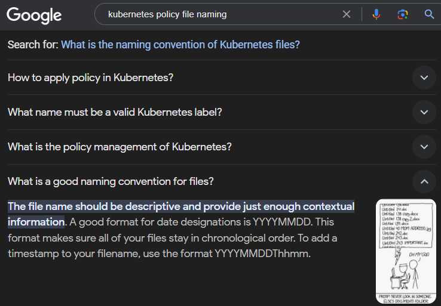

# Google Scripts

## Google.com (search engine)

### [Google Question Suggestion Remover](GoogleQuestionSuggestionRemover.user.js)
Removes the "People also ask" section which lists even dumber questions people have asked:

Also removes the "What People are Saying" section, because people say things that are even dumber than the questions they ask.

I didn't feel a need to split these into separate scripts. I'm on the fence about hiding videos. Let me know if you'd prefer otherwise.

## Bard - bard.google.com
Google's Large Language Model AI chatbot

### [Bard Move Listen Button](BardMoveListenButton.user.js)
Some genius designer put the button at the top of the response's text box.
But Bard is verbose, so we often get scrolled away from it.
Why should we need to scroll up to the top of the text just so it can read to us?

### [Docs Gemini Hider](DocsGeminiHider.user.js)
Hides "Try Gemini" button trying to get you to start a subscription trial

## Gmail - mail.google.com

### [Gmail Ad Remover](GmailAdRemover.user.js)
Removes the ads shown in Gmail.
Remove Google Ads: created
Runs on a 2-second interval to avoid any system impact.

And for fun it also counts and console logs the number of ads removed per tab and in total:

## YouTube - youtube.com

### [Auto Speed](YoutubeAutoSpeed.user.js)
Automatically adjusts the speed of videos based on a words-per-minute analysis of the transcript.

This is an early version and has many issues which could be addressed:
* Speeds are hard-coded to pretty random values at the moment and require adjustment.
* English and US centric.
* Does not detect videos which should always play at normal speed
** (update: v1.1 added a simplistic detection system to handle some music videos)

Please create issues or submit pull requests for changes you want.

### [Hide Next Videos](YoutubeHideNextVideos.user.js)
Removes suggestions for other videos to watch.

This includes:
* "Next Video" thumbnails that often cover up content you want to see during the last few seconds of playback
* The "Video Wall" shown after a video
* Related videos panel

### [No Comment](YoutubeNoComment.user.js)
Removes comments. Because even Google knows...

- Q: But what if there are comments I want to see? Can you add something I can click to unhide them?
- A: Nope. The friction is intentional. Of course you could disable the script or use Incognito Mode. But you probably shouldn't.
- Q: That's really annoying. What about showing only the top one or two comments? Say if the upvotes on it exceed a whopping 10% of views! That only happens when the creator comments!
- A: That's a great point but requires choosing some arbitrary value. So... No.
- Q: What if the creator themselves liked the comment?
- A: Even better! Still no.
- Q: How about an allow-list to which I can add my favorite creators who inspire positive communities?
- A: If you submit a pull request, I'll consider merging it.
