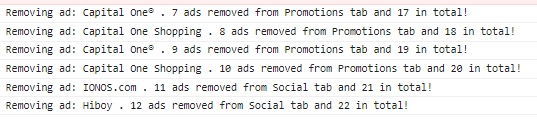
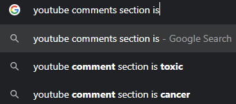

# Google Scripts

## Gmail - mail.google.com

### [Gmail Ad Remover](GmailAdRemover.user.js)
Removes the ads shown in Gmail.
Remove Google Ads: created
Runs on a 2-second interval to avoid any system impact.

And for fun it also counts and console logs the number of ads removed per tab and in total:

## YouTube - youtube.com

### [Hide Next Videos](YoutubeHideNextVideos.user.js)
Removes suggestions for other videos to watch.

This includes:
* "Next Video" thumbnails that often cover up content you want to see during the last few seconds of playback
* The "Video Wall" shown after a video
* Related videos panel

### [No Comment](YoutubeNoComment.user.js)
Removes comments. Because even Google knows...

- Q: But what if there are comments I want to see? Can you add something I can click to unhide them?
- A: Nope. The friction is intentional. Of course you could disable the script or use Incognito Mode. But you probably shouldn't.
- Q: That's really annoying. What about showing only the top one or two comments? Say if the upvotes on it exceed a whopping 10% of views! That only happens when the creator comments!
- A: That's a great point but requires choosing some arbitrary value. So... No.
- Q: What if the creator themselves liked the comment?
- A: Even better! Still no.
- Q: How about an allow-list to which I can add my favorite creators who inspire positive communities?
- A: If you submit a pull request, I'll consider merging it.
